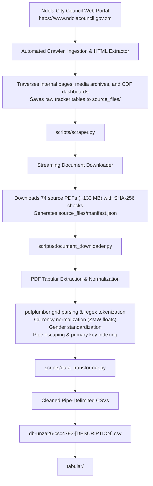

# Ndola City Council Municipal Open Data Engineering Pipeline

[](https://www.python.org/downloads/)
[](https://github.com/astral-sh/uv)
[](https://cs.unza.zm)
[](https://creativecommons.org/licenses/by/4.0/)

> **Course:** 2025/26 CSC 4792: Data Mining and Warehousing  
> **Institution:** The University of Zambia (UNZA), Department of Computing and Informatics  
> **Assigned Local Authority:** **Ndola City Council (Republic of Zambia)** — Project Team #2  
> **Attention:** Dr. Lighton Phiri  
> **Official Portal:** [https://www.ndolacouncil.gov.zm](https://www.ndolacouncil.gov.zm)

---

## Project Overview

This repository contains the complete, reproducible end-to-end data mining, web scraping, tabular extraction, and data cleaning pipeline for curating an open municipal dataset for the **Ndola City Council (NCC)** in Zambia.

The dataset captures decentralized fiscal expenditures, educational bursaries, infrastructure investments, and local governance operations under the statutory framework of the **Zambian Local Government Act No. 2 of 2019** (and 2023/2026 amendments) and the **Constituency Development Fund (CDF) Act No. 11 of 2018**.

Spanning four parliamentary constituencies (**Ndola Central, Bwana M’kubwa, Chifubu, Kabushi**), this project provides **3,540 standardized records** exported as CSV files.

---

## Repository File & Directory Structure

```
data-mining-assignment/
├── README.md                                                 # Project overview, architecture & setup guide
├── pyproject.toml                                            # Project configuration and uv dependencies
├── requirements.txt                                          # Alternative pip requirements
├── Prompt.md                                                 # System directive & project constraints
├── Data_in_Brief_Ndola_Council.md                           # Elsevier Data in Brief journal draft
├── Kaggle_Description.md                                     # Kaggle dataset description & documentation
├── docs-unza26-csc4792-group_project_specification.pdf       # UNZA CSC 4792 course project specification
│
├── scripts/                                                  # Standalone Python automation scripts
│   ├── scraper.py                                            # Web crawler & HTML table extractor
│   ├── document_downloader.py                                # Streaming document downloader with SHA-256
│   ├── run_all_scrapers.py                                   # Step 1 orchestration pipeline
│   └── data_transformer.py                                   # PDF tabular extraction & cleaning engine
│
├── source_files/                                             # Raw acquired data artifacts (52 files, ~133 MB)
│   ├── manifest.json                                         # Cryptographic SHA-256 document manifest
│   ├── site_discovery_index.json                             # Discovered endpoint crawl tree (74 document links)
│   ├── ndola_council_tracker_raw.html                        # Raw HTML CDF tracker dump
│   ├── ndola_council_cdf_tracker_tables.json                 # Structured JSON tracker tables
│   └── *.pdf                                                 # 48 official municipal publication & report PDFs
│
├── notebooks/                                                # Interactive Jupyter Analysis
│   └── data_extraction_and_cleaning.ipynb                    # Documented extraction, cleaning & export notebook
│
└── tabular/                                                  # Final cleaned pipe-delimited ('|') CSV files
    ├── db-unza26-csc4792-ndola_council_cdf_community_projects_2024_2025.csv             (216 rows)
    ├── db-unza26-csc4792-ndola_council_cdf_skills_bursaries_2025.csv                   (2,476 rows)
    ├── db-unza26-csc4792-ndola_council_cdf_secondary_boarding_bursaries_2025.csv          (77 rows)
    ├── db-unza26-csc4792-ndola_council_cdf_empowerment_grants_loans_2025.csv            (689 rows)
    ├── db-unza26-csc4792-ndola_council_municipal_budget_and_expenditure_2024_2026.csv   (55 rows)
    └──
```

## Tabular Datasets Summary

All tabular datasets strictly adhere to the specification naming convention `db-unza26-csc4792-[DESCRIPTION].csv` and use the pipe character (`"|"`) as the column delimiter:

| Output Dataset                                                                       |  Records  | Description                                                                                                                | Primary Key            |
| :----------------------------------------------------------------------------------- | :-------: | :------------------------------------------------------------------------------------------------------------------------- | :--------------------- |
| `db-unza26-csc4792-ndola_council_cdf_community_projects_2024_2025.csv`               |  **216**  | Approved and disapproved community infrastructure projects (schools, clinics, roads, water schemes) across Ndola District. | `project_id`           |
| `db-unza26-csc4792-ndola_council_cdf_skills_bursaries_2025.csv`                      | **2,476** | Tertiary, technical, and vocational skills development bursary beneficiaries across all 4 constituencies.                  | `bursary_id`           |
| `db-unza26-csc4792-ndola_council_cdf_secondary_boarding_bursaries_2025.csv`          |  **77**   | Secondary school boarding bursaries awarded to vulnerable pupils.                                                          | `secondary_bursary_id` |
| `db-unza26-csc4792-ndola_council_cdf_empowerment_grants_loans_2025.csv`              |  **689**  | Youth, women, and community cooperative empowerment grants and revolving loan disbursements.                               | `empowerment_id`       |
| `db-unza26-csc4792-ndola_council_municipal_budget_and_expenditure_2024_2026.csv`     |  **55**   | Output-Based Budget (OBB) estimates, revenue categories, and expenditure line items.                                       | `budget_record_id`     |
| `db-unza26-csc4792-ndola_council_governance_and_committee_resolutions_2024_2025.csv` |  **27**   | Formal council committee resolutions and DDCC deliberations.                                                               | `resolution_id`        |

## Installation & Execution Guide

We recommend using [`uv`](https://github.com/astral-sh/uv), the extremely fast Python package and project manager. Alternatively, standard Python `venv` with `pip` can be used.

### Prerequisites

- Python `>= 3.10`
- `uv` installed ([uv installation guide](https://docs.astral.sh/uv/getting-started/installation/)):

**macOS / Linux:**

```bash
curl -LsSf https://astral.sh/uv/install.sh | sh
```

**Windows (PowerShell):**

```powershell
powershell -ExecutionPolicy ByPass -c "irm https://astral.sh/uv/install.ps1 | iex"
```

After installation, restart your terminal, then verify:

```bash
uv --version
```

---

### Method 1: Running with `uv` (Recommended)

1. **Clone the Repository:**

    ```bash
    git clone git@github.com:Mwale-Jonathan/db-unza26-csc4792-ndola-city-council.git
    cd db-unza26-csc4792-ndola-city-council
    ```

2. **Sync the Environment:**
   `uv` will automatically create a virtual environment and install all dependencies:

    ```bash
    uv sync --all-groups
    ```

3. **Execute Step 1 — Web Scraping & Data Acquisition:**
   Crawl the portal, extract HTML tables, and download all raw source PDFs into `/source_files/`:

    ```bash
    uv run python scripts/run_all_scrapers.py
    ```

4. **Execute Step 2 — Tabular Extraction & Cleaning:**
   Parse raw PDFs, clean data types, and generate pipe-delimited CSVs in `/tabular/`:

    ```bash
    uv run python scripts/data_transformer.py
    ```

5. **Launch and Run the Jupyter Notebook:**
    ```bash
    # Launch Jupyter Lab or Notebook to view interactive extraction & cleaning steps
    uv run jupyter lab
    # Or: uv run jupyter notebook notebooks/data_extraction_and_cleaning.ipynb
    ```

---

### Method 2: Running with Standard `pip` and `venv`

1. **Create and Activate Virtual Environment:**

    ```bash
    python3 -m venv .venv
    source .venv/bin/activate
    ```

2. **Install Dependencies:**

    ```bash
    pip install -r requirements.txt
    ```

3. **Run the Extraction Pipeline:**

    ```bash
    python scripts/run_all_scrapers.py
    python scripts/data_transformer.py
    ```

4. **Open the Notebook:**
    ```bash
    jupyter notebook notebooks/data_extraction_and_cleaning.ipynb
    ```

## Pipeline Architecture & Methodology



## Deliverable Documents

- **Elsevier Data in Brief Paper:** [`Data_in_Brief_Ndola_Council.md`](Data_in_Brief_Ndola_Council.md)
- **Kaggle Dataset:** Kaggle_Description.md
- **Course Specification:** [`docs-unza26-csc4792-group_project_specification.pdf`](docs-unza26-csc4792-group_project_specification.pdf)

---

## Contributors & Acknowledgements

- **Project Team #2**, Department of Computing and Informatics, School of Natural Sciences, The University of Zambia.
- **Course Instructor / Supervisor:** Dr. Lighton Phiri (`lighton.phiri@gmail.com` / `lighton.phiri@unza.zm`).
- **Data Source:** [Ndola City Council (NCC)](https://www.ndolacouncil.gov.zm), Republic of Zambia.

---

## License

This repository and the curated datasets are licensed under the [MIT License](LICENSE).
